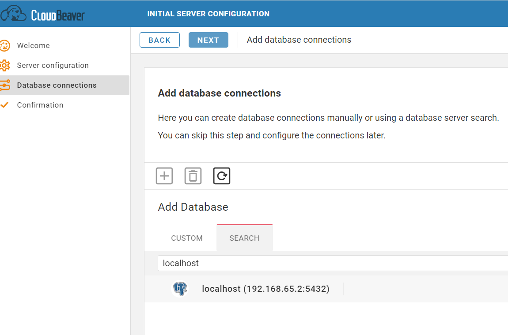
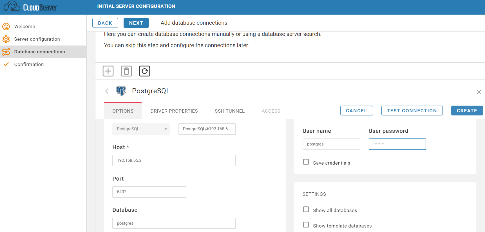
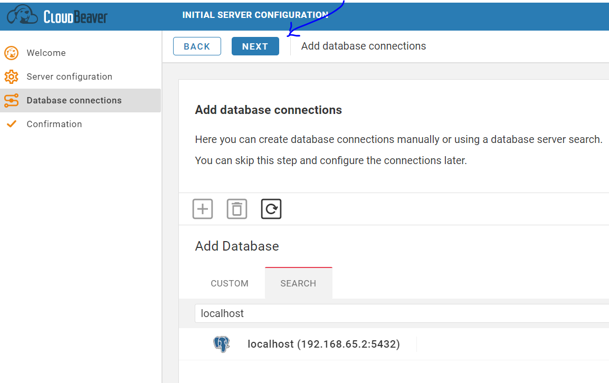
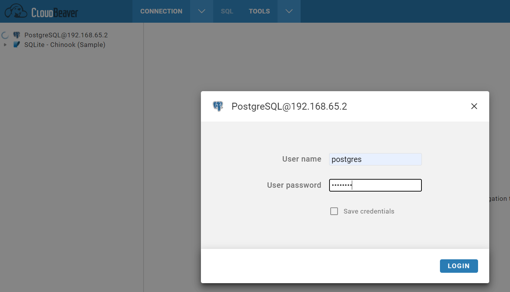
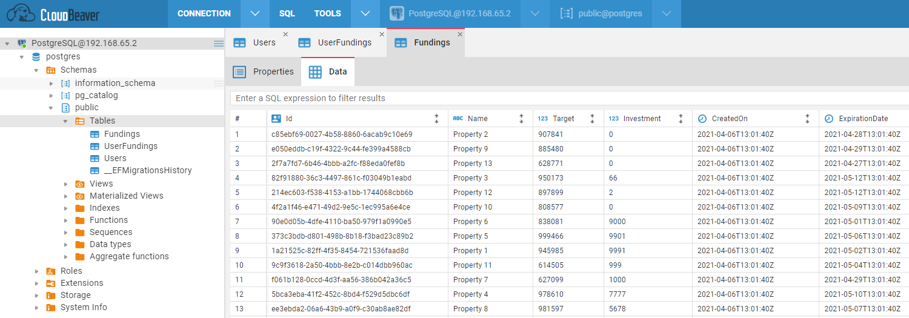
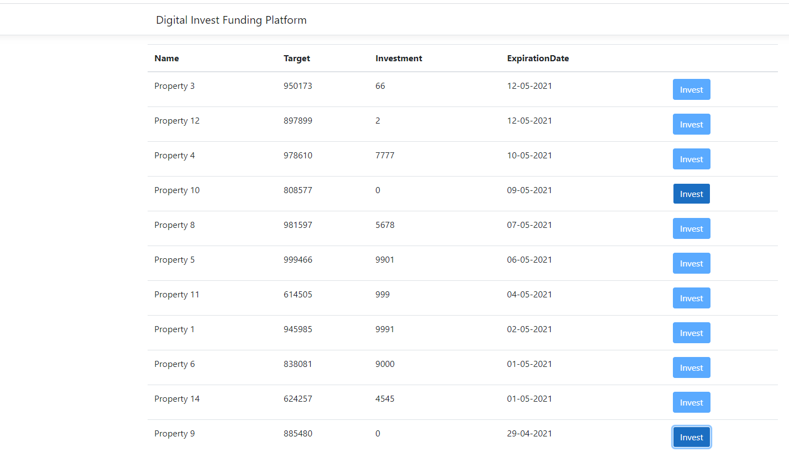



# funding-platform

# Table of Contents
* [Overview](#overview-)
* [Technologies Used](#technologies-used-)
* [Solution Structure](#solution-structure-)
* [Local Machine Setup](#local-machine-setup-)
* [Requirements](#requirements-)
* [Solution](#solution-)
* [Improvements](#improvements-)
* [Pain Points](#pain-points-)

## Overview [↑](#table-of-contents)

Funding Platform is a .NET Core MVC web application that displays fundings for a user to invest in. 

## Technologies Used [↑](#table-of-contents)
- .NET Core 3.1 
- Entity Framework Core 3.1 
- [Visual Studio](https://visualstudio.microsoft.com/downloads/) - Visual Studio or Visual Studio Code.
- [Npgsql.EntityFrameworkCore.PostgreSQL](https://github.com/npgsql/Npgsql.EntityFrameworkCore.PostgreSQL) - Provider for PostgreSQL database.
- [AutoMapper](https://automapper.org/) - Library for mapping one .NET object to another.
- [Docker](https://docs.docker.com/) - To run the database locally without installing Postgres and PgAdmin/Dbeaver.

## Solution Structure [↑](#table-of-contents)
- DigitalInvest.FundingPlatform- source code for the web app
  - DigitalInvest.FundingPlatform - main project
    - Configuration - settings classes to map from appSettings.json files 
    - Controllers - .NET Core MVC controllers 
    - DataAccess - data access layer with Entity Framework Core ORM
      - Entities - objects to be stored in database
    - Exceptions - custom exceptions created 
    - Extensions - extension classes to extend ability of certain classes for cleaner code 
    - Mappings - Automapper profiles that map from entities to view models and vice versa
    - Migrations - migrations to keep the database in sync with entities
    - Models - view models to be displayed in views 
    - Properties - includes launchSettings.json that has project specific settings associated with profile
    - Repository - layer abstracting the domain from data persistance 
    - Services - business logic injected to ASP.NET Core DI to be abstracted from presentation 
    - Views - handles the app's data presentation and user interaction using Razor markup
    - wwwroot - js scripts and css used in the presentation
  

## Local Machine Setup [↑](#table-of-contents)

1. Install VS2019, [.NET Core SDK](https://dotnet.microsoft.com/download/dotnet/3.1) and [docker](https://docs.docker.com/engine/install/) along with [docker compose](https://docs.docker.com/get-started/08_using_compose/).
2. Clone the repository. 
3. Go to DigitalInvest.FundingPlatform folder and open cmd/git bash to run the following command: 
`docker-compose up`

4. Open terminal or Package Manager Console in order to create the database. Run:
`dotnet ef database update` or `update-database` respectively.

5. If you want to connect to the database, go to `localhost:8978` to use CloudBeaver. 

Click "Next" and enter admin config info - you can enter `password` as the password here.

Then add database connection by clicking on `localhost`. 

Then fill in configuration info by adding username and password both as `postgres`. Click "Create".

In the next screen, click "Next".

And finish setting up by clicking "Finish".

Your database is ready to be connected. Click on "PostgreSQL" and you'll be prompted to enter user name and password, which are both `postgres`.

Voila! 

Go to `postgres` > `Schemas` > `public` > `Tables` > `Fundings` and you should see some data.

Then run your application on Visual Studio.

Initially the investments will all be "0" - after you've invested in some, it will look like above.

## Requirements [↑](#table-of-contents)
•	User can see a list of fundings with investment required.

•	User click on a funding and submit an amount (between 100€ and 10.000€) for a funding.

•	Can only submit an amount once per funding.

## Solution [↑](#table-of-contents)

Current solution only considers one user. User can do all the things mentioned in requirements.
Ideally we would have several projects to divide the solution such as: Presentation (Views, Controllers etc), Data, Business, Repository, Tests. Business would be in the core and would not depend on any other projects. 
Due to time constraints, this architecture wasn't adopted.

## Improvements [↑](#table-of-contents)

Some of these could not be implemented, because of time constraints and some issues being faced. 

**Tests:** 
Unit tests should be implemented. 

**Authentication:**
Identity Server could be used to manage users easily. Jwt Token based authentication could be done - a custom authentication attribute could be implemented. 

**Many to many relationship:**
Many to many relationship between user and fundings because a funding can have many users and a user can invest in many fundings (in the future).

**Dockerize the app:**
Only the database part was dockerized for now. The application could also be brought up with the database services.

**Exception handling:** 
Global exception handling can be improved.

**Logging:** 
Logging was not implemented.

## Pain Points [↑](#table-of-contents)

MVC was adopted as I've worked with it a little previously, however this made things more complex and coupled. Some parts would have been implemented differently if API was implemented separately, eg. exception handling, API design (RESTful).   